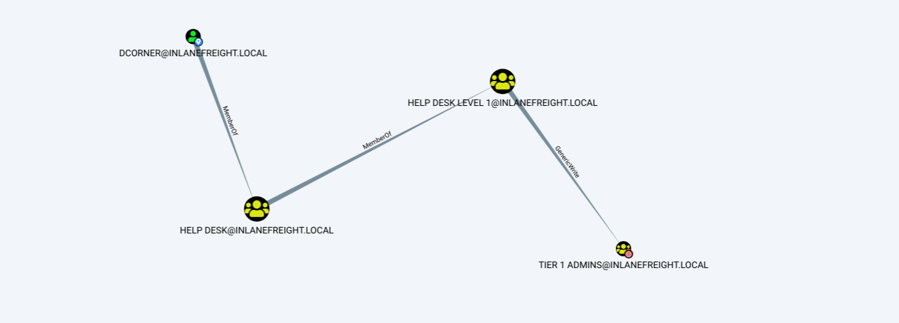

# AD Groups

Groups are used to place users, computers and contact objects into management units that provide ease of administration over permissions and fascilitate the assignment of resources.

Groups in AD have two characteristics:
- **Type :** Defines the group's purpose.
    1. Security : Primarily for ease of assigning permissions and rights to a collection of users.
    2. Distribution : It is used by *email applications* ie Microsoft exchange to distribute messages to group members.
- **Scope:** It shows how this group can be used within the domain or forest.
    1. **Domain Local group** : Used to manage permissions to domain resources in the domain where it was created. It cannot be used in other domains but can contain users from other domains.
    2. **Global group** : Can be used to grant access to resources in *another domain*. It can contain accounts of its own domain. It can be added to both local groups and global groups as nested.
    3. **Universal group** :Used to manage resources across multiple domains and permissions within the same forest.It can contain users of any domains. Universal groups are stored in the `Global catalog (GC)`. Replication will trigger forest wide each time a change is made. 

```
Get-ADGroup  -Filter * |select samaccountname,groupscope

Administrators                          DomainLocal
Users                                   DomainLocal
Guests                                  DomainLocal
Domain Computers                             Global
Domain Controllers                           Global
Schema Admins                             Universal
Enterprise Admins                         Universal
Cert Publishers                         DomainLocal
Domain Admins                                Global
Domain Users                                 Global
Domain Guests                                Global
```
## Built-in/Custom groups

Only user accounts can beed to these built-in groups as they don't allow for group nesting.

## Nested group membership

Bloodhound is particularly useful in uncovering privileges that a user may inherit through on or more nesting groups.



## Important group attributes

- `cn` : Common-name is the name of the group
- `member` : Which user, group and contact objects are members of the group.
- `groupType` : An integer that specifies the group type and scope.
- `memberOf` : A listing of any groups that contain the group as a member.
- `objectSid` : The security identifer of the group.

